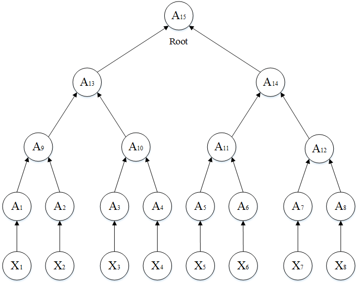

# MerkleTree
Merkle tree is a classic data structure for checking data integrity, this project aim to build tree and simulate the challenge-respond between client and server.

Let imagine a scenery, you upload a 2GB file `A` to you web server and the file is stroed block by block (a1, a2, ...). Before you upload `A`, you stroe a `root node` of the merkle tree which is caculated by those blocks. After you upload `A`, you delete file `A` in your computer. After a period, you want to make sure if those blocks are integral. Then, you download one of the blocks from sever (to be simplified, suppose you download a1), at the sometime the server returns you a `authentication path`. You get a value caculated by a1 and `authentication path`, after that, you check in if `root node` is equal to the caculated value, if ture, you get a answer 'Server is good, the data is integrity.', else you wonder 'On, no... the data is not integrity!'.

> ### What is Merkle Tree looks like?

  
  
pic1. Merkle Tree classic construction

Suppose we split file `A` into 8 equal pieces, this is block1, block2, ..., block8. We use `sha256` to get the blcok hash tags corresponding to X1, X2, ..., X8 in pic1. We class nodes as follows:

- leaf node: X1, X2, ..., X8;
- middle node (a.k.a none-leaf node): A1, A2, ..., A14;
- roof node: A15.
  
In [merkle_tree.py](merkle.tree.py), the `Node` class is implemented. Each node has five properties:
1. **node_id**: to identify node;
2. **value**: each node maintain a value which is bonded with its child nodes;
3. **parent_node**: let's take A10 for example, its parent node is A13;
4. **left_node**: Merkle Tree is a sequence structure, A9 is the left child of A13;
5. **right_node**: similar to above, A10 is the right child of A13. 

In Merkle Tree, the parent node's value is bonded with its child's values. To be simplified, I choose sha512:

parent_node.value = sha512(right_child.value + left_child.vlaue)

However, before we generate a Merkle Tree, how to get tags X1, X2, ..., X8? As we mentioned above, Xi is calculated by blocki using sha256 where i &#8712; (1, 2, ..., 8).

> ### How to split a file into blocks with specified block size?
